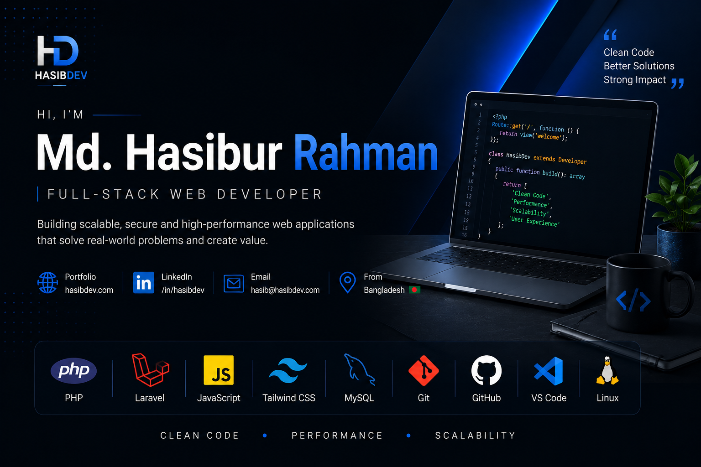

  

 

<h3 align="center">Md. Hasibur Rahman</h3>

Full-Stack Web Developer

  <a href="https://hasibdev.com">🌐 hasibdev.com</a> ·
  <a href="https://linkedin.com/in/hasibdev">💼 LinkedIn</a> ·
  <a href="mailto:hasib@hasibdev.com">📧 Email</a>

 

## About

I'm a Full-Stack Web Developer with **5 years of experience** building scalable, secure web applications using **Laravel and Livewire** — from e-commerce and point-of-sale systems to hotel management platforms. I care about clean architecture, performance, and shipping software that solves real business problems, not just demos.

 

## Tech Stack

**Languages & Frameworks**

**Frontend**

**Database**

**Tools & Environment**

 

## Featured Work

**🛒 E-Commerce Platform**
Full online store — product catalog, cart, checkout, and order management. *(Previously live in production; currently offline.)*

**🧾 POS System**
Point-of-sale system for in-store billing, inventory tracking, and sales reporting.

**🏨 Hotel Management System**
Booking, room, and guest management built for real hospitality workflows.

**💻 Developer Portfolio**
Laravel + Livewire portfolio with a fully custom, database-driven admin dashboard.

*Repo links coming soon — replace this line once your projects are pushed to GitHub.*

 

## Get in Touch

Open to freelance work and collaboration on Laravel/Livewire projects — reach out via [email](mailto:hasib@hasibdev.com) or [LinkedIn](https://linkedin.com/in/hasibdev).
